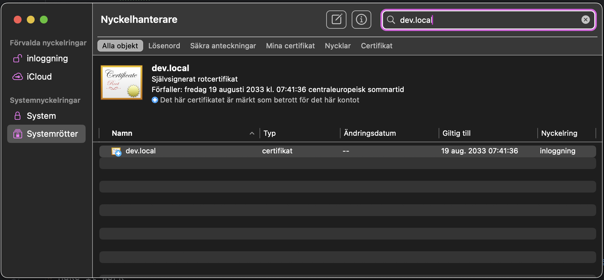
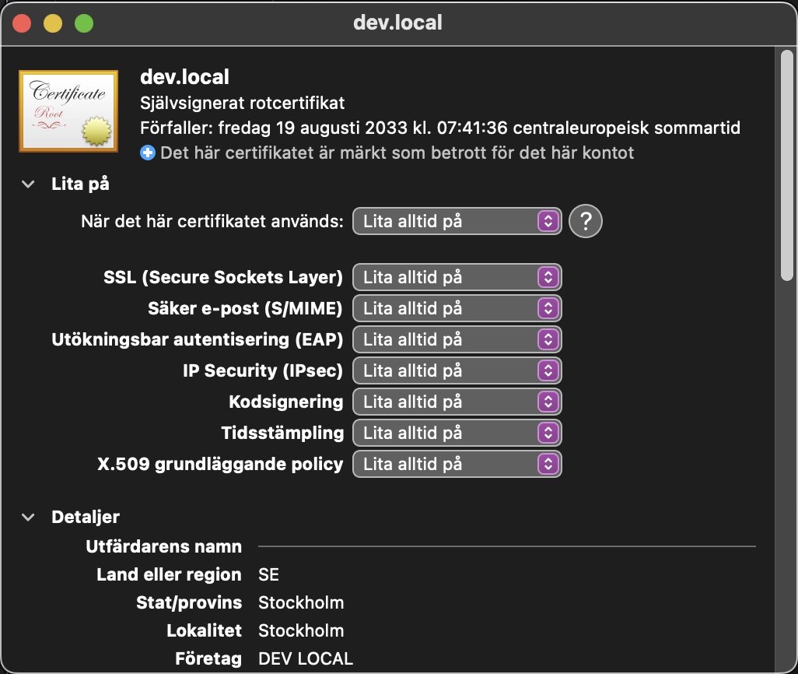
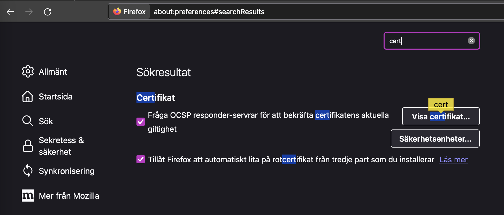

# macOS - How to get a trusted HTTPS

Date: 2024-03-01

## macOS - Install certificate on keychain

Start the keychain application.
Search for "key" and start the keychain ("Nyckelhanterare" in swedish)
You might be asked if you want the password manager or the keychain manager.

Menu "Archive" (Arkiv), "Import object" (Importera objekt).
Select the dev_local.crt file from this folder.

## macOS - Trust the certificate

Search for "dev.local" 
Double click on the certificate. Open up "trust". Select that you always trust (Lita på) this certificate.

## macOS - Allow notifications

See [allow notifications](macos-allow-notifications.md)

## macOS - Use the certificate in Safari browser

Unfortunately no browser except Safari use this certificate.

Start Safari. Surf to https://dev.local/
Enjoy the trusted HTTPS and start developing with Javascript that only work with HTTPS, like notification API and much more.

## macOS - Firefox browser

Firefox have its own list with trusted certificates.
Go into settings and search for cert.
You can upload the dev.local.crt file and select full rights.
The file turn up as trusted in the Firefox list.
When you surf to https://dev.local/ it is still not trusted but the Notification API works anyhow.

## macOS - Brave browser

You can add certificates but that just open up the macOS Keychain.
When you surf to https://dev.local/ it is still not trusted but the Notification API works anyhow.

## macOS - Chrome browser

## macOS - Opera browser