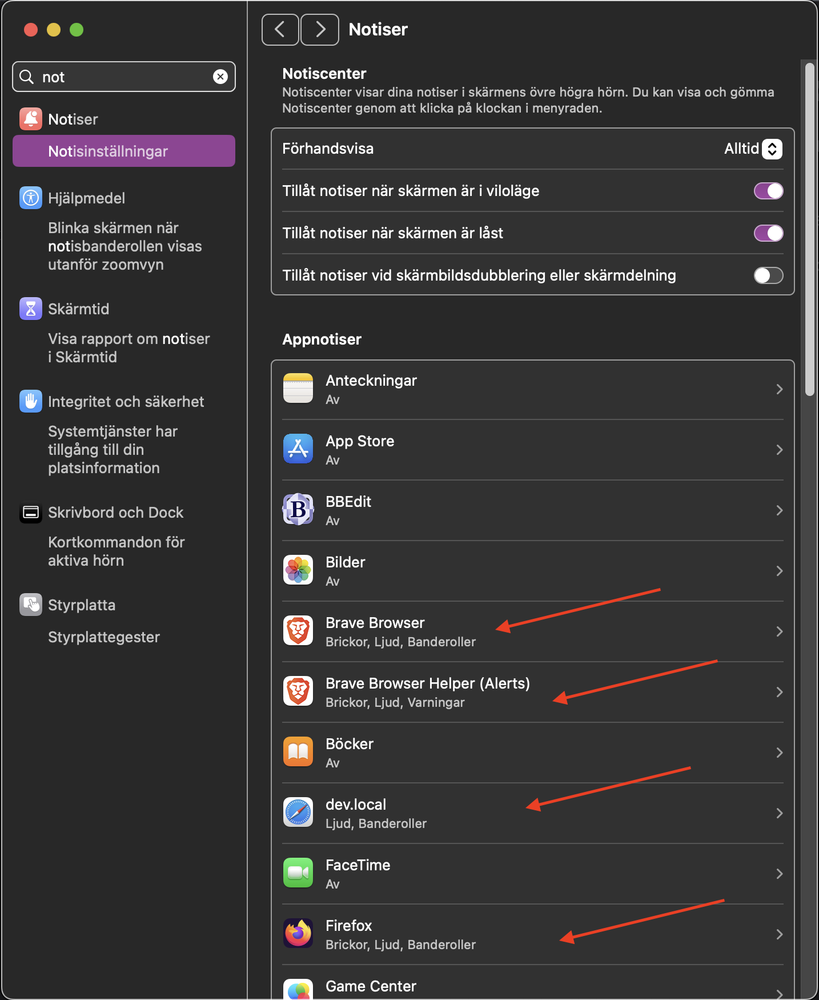
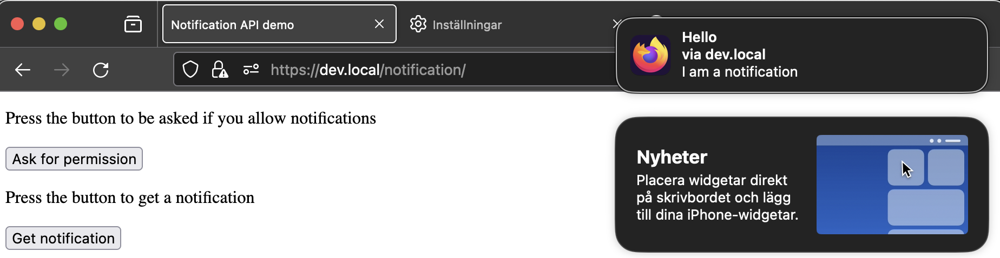

# Allow notifications

If you want to use the [Notification API](https://developer.mozilla.org/en-US/docs/Web/API/Notifications_API/Using_the_Notifications_API),
then you also need to allow the brows er to send notifications to the macOS notification center.

Open the macOS system settings.
Search for "not" to find the notification center.

Make sure your browsers you use are allowed to send notifications.

Then you can expect the notification API to deliver your notification from your browser.
I have tested in macOS with Safari, Opera, Brave, FireFox. They all deliver.

Example from the FireFox browser

